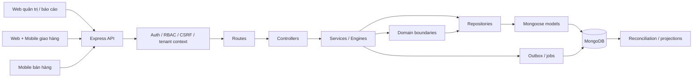
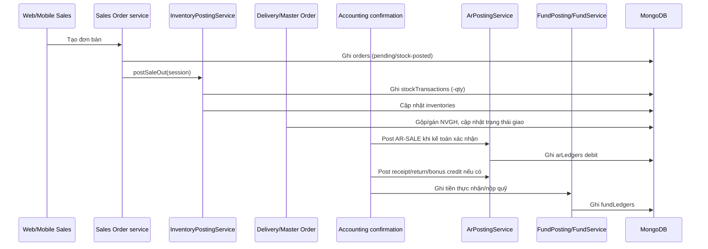

# MK-PRO — Architecture & SSoT Audit

**Ngày audit:** 2026-06-19  
**Phạm vi:** toàn bộ workspace `E:\MK-pro`, không gồm nội dung dependency trong `node_modules`  
**Kiểu audit:** static architecture review, dependency/data-write scan, review schema/index, kiểm tra source bundle, syntax, OpenAPI và test hiện có  
**Trạng thái kết luận:** kiến trúc **modular monolith chuyển tiếp**, dùng được cho mô hình một doanh nghiệp/NPP sau khi xử lý P0; **chưa an toàn để bật multi-tenant hoặc coi các ledger là hoàn toàn bất biến**.

> Giới hạn quan trọng: audit này không kết nối MongoDB staging/production, vì vậy không xác nhận được dữ liệu thật, index thật, transaction trên replica set, dung lượng collection, query plan, backup/restore và sai lệch ledger thực tế. Các nhận định về code được dẫn chứng trực tiếp; các nhận định cần dữ liệu thật được ghi là “rủi ro”.

## Tóm tắt điều hành

MK-PRO là ứng dụng Node.js/Express/Mongoose theo mô hình modular monolith, phục vụ web quản trị, web giao hàng và mobile bán/giao hàng. Hệ thống có 3 nguồn dữ liệu trọng yếu đã được định hướng đúng:

| Nghiệp vụ | Sổ gốc / lịch sử | Projection / chứng từ | Kết luận |
|---|---|---|---|
| Tồn kho | `stockTransactions` | `inventories` | Định nghĩa đúng, nhưng còn 4 đường bulk import đi vòng posting boundary và reconciliation đang so nhầm `availableQty` với ledger vật lý. |
| Công nợ | `arLedgers` | `orders.debtAmount` và các snapshot chỉ là cache | Định hướng đúng, nhưng ledger còn bị upsert/xóa; script rebuild AR có rủi ro phá dữ liệu và bỏ sót external debt. |
| Quỹ | `fundLedgers` | `expenseVouchers`, `fundTransfers`, `deliveryCashSubmissions`; `cashbooks`/`bankbooks` là legacy | Định hướng đúng, nhưng API ghi cashbook thủ công vẫn hoạt động và không ghi `fundLedgers`. |

Điểm mạnh đáng giữ:

- MongoDB là runtime store chính; JSON chỉ còn dữ liệu mẫu/migration.
- Có transaction helper, idempotency, reconciliation job, outbox, audit, centralized index plan và graceful shutdown.
- Có các domain boundary cho posting, lifecycle, settlement, reconciliation và print.
- 806 file JavaScript qua syntax check; OpenAPI đồng bộ; source-size budget đạt.
- Test trực tiếp chạy được 665 case, 664 pass; case lỗi duy nhất là test phân biệt hoa/thường tên file trên Windows, không phải lỗi nghiệp vụ runtime.

Rủi ro lớn nhất:

1. `rebuild:ar-ledger` xóa ledger trước, không transaction/dry-run mặc định, rebuild sai phạm vi và không dựng lại external debt.
2. Index quan trọng có thể tạo thất bại nhưng startup vẫn tiếp tục.
3. Multi-tenant mới dừng ở middleware và module enterprise; phần core không scope query/write theo tenant và nhiều unique/idempotency key vẫn global.
4. Ba SSoT còn các đường ghi legacy/bypass làm dữ liệu có thể phân kỳ.
5. Kiến trúc tầng được mô tả là `route -> controller -> service -> repository -> model`, nhưng code thực tế có route/controller dùng model/engine trực tiếp và service dùng model trực tiếp rất rộng.

---

## 1. Kiến trúc hệ thống

### 1.1 Công nghệ và topology runtime

- Backend: Node.js CommonJS, Express 4, Mongoose 8.
- Database: MongoDB; `src/config/db.js` tắt `autoIndex` mặc định và dùng `mongoIndexService` để quản lý index.
- Frontend: HTML/CSS/JavaScript cổ điển, được ghép từ shell/fragments; một số bundle được sinh từ `.jsfrag`.
- Client: web quản trị, web giao hàng, mobile sales, mobile delivery.
- Worker nội tiến trình: reconciliation, outbox, integration và reporting projection (`src/app.js:284-291`).
- Auth: JWT access/refresh qua HttpOnly cookie; Bearer vẫn được hỗ trợ cho client tích hợp.
- Enterprise modules: purchase, warehouse advanced, analytics projection, offline sync, field operation, delivery planning, integration và platform/multi-tenant; đa số tắt mặc định bằng feature flag.



### 1.2 Cấu trúc định lượng

| Thành phần | Số lượng quan sát | Nhận xét |
|---|---:|---|
| File ngoài dependency | khoảng 1.473 | Bao gồm 266 tài liệu `.md`, 806 `.js`, 49 `.jsfrag`, 46 `.json`. |
| Routes JavaScript | 49 | `src/routes/index.js` mount cả core và enterprise. |
| Controllers JavaScript | 43 | Phần lớn mỏng, nhưng return/delivery/auth còn vượt tầng. |
| Services JavaScript | 141 | Tầng lớn nhất; vừa orchestration, vừa domain logic, vừa truy cập model. |
| Domain files | 27 | Posting, lifecycle, settlement, reconciliation, print, staff, catalog. |
| Repositories | 31 | Chưa phải đường persistence bắt buộc. |
| Models | 71 | 39 model dùng `_flexModel`; 17 model enterprise dùng `_strictModel`; còn lại schema Mongoose riêng/factory. |
| Test cases hiện tại | 665 | Nhiều static contract/regex test; chưa thay thế integration test Mongo thật. |

### 1.3 Kiến trúc tầng: chủ đích và thực tế

Chủ đích được ghi tại `src/routes/README.md`:

```text
route -> controller -> service -> repository -> model/database
```

Thực tế dependency scan trên 442 file runtime trong `src` cho thấy:

- `routes -> models`: 7 cạnh; `routes -> engine`: 1 cạnh; `routes -> domain`: 1 cạnh.
- `controllers -> models`: 6 cạnh; `controllers -> engine`: 1 cạnh.
- `services -> models`: 159 cạnh; `services -> repositories`: 65 cạnh.
- `domain -> models`: 17 cạnh; `domain -> services`: 9 cạnh.
- `repositories -> services/domain`: 4 cạnh.

Do đó hệ thống chưa phải layered architecture nghiêm ngặt. Mô tả đúng hơn là **modular monolith có facade/domain boundary nhưng persistence và dependency direction chưa được cưỡng chế đồng nhất**.

### 1.4 Composition và startup

`src/app.js` là composition root chính:

1. Cài security middleware và tenant context (`src/app.js:135-165`).
2. Mount API qua `src/routes/index.js`.
3. Kết nối MongoDB.
4. Kiểm tra/tạo index, recovery import.
5. Khởi động outbox, integration, reporting projection, reconciliation.
6. Serve static web/mobile.

Điểm cần lưu ý: `DeliveryEngine` lại được khởi tạo riêng tại route/controller bằng cách truyền trực tiếp model (`src/routes/deliveryRoutes.js:3-15`, `src/controllers/returnOrderController.js:3-14`). Đây là composition phân tán, làm khó thay repository/test double và tạo hai cách gọi cùng nghiệp vụ.

---

## 2. Module nghiệp vụ

| Module | Route/API chính | Model/SSoT chính | Ghi chú kiến trúc |
|---|---|---|---|
| Identity, Auth, RBAC | `/api/auth`, `/api/users` | `users`, `roles`, `permissions` | `authRoutes` chứa cả service logic và truy cập `User` trực tiếp. |
| Sản phẩm & khách hàng | `/api/products`, `/api/customers`, `/api/catalog`, `/api/search` | `products`, `customers`, `users` cho nhân viên | Có repository nhưng service/import vẫn truy cập model trực tiếp. |
| Khuyến mại | `/api/promotions` | `promotions`, `promotionProductRules`, `promotionGroupItems`, `promotionGroupRules` | Snapshot giá/khuyến mại được giữ trên order để in/report lịch sử. |
| Bán hàng | `/api/sales-orders`, alias `/api/orders`; mobile sales | `orders` (`SalesOrder`) | Tạo đơn post tồn ngay; AR chỉ post khi xác nhận kế toán/giao hàng. |
| Đơn tổng & giao hàng | `/api/master-orders`, `/api/delivery` | `master_orders` + child `orders` | `DeliveryEngine` và master-order strangler cùng tồn tại. |
| Nhập hàng/DMS/Excel | `/api/import-orders`, `/api/import`, `/api/excel`, `/api/dms-inventory` | `imports`, import sessions/rows, DMS snapshots | Two-phase preview/commit; opening stock và bulk import còn bypass được ghim. |
| Trả hàng | `/api/return-orders`, `/api/returns`, `/api/master-return-orders` | `returnOrders`, `masterReturnOrders` | State machine rõ; một số read/write ngoài session. |
| Tồn kho | `/api/inventory`, stock/report aliases | `stockTransactions` + `inventories` | `InventoryLegacy` là tên model gây hiểu nhầm dù collection là canonical. |
| Công nợ & phiếu thu | `/api/receipts`, `/api/debt-collections`, `/api/external-debt-orders` | `arLedgers`; chứng từ `receipts`, `debtCollections`, `externalDebtOrders` | `journals`/`Payment` còn tồn tại cho migration/compatibility. |
| Quỹ | `/api/funds`, `/api/cashbook`, `/api/bankbook` | `fundLedgers`; chứng từ quỹ | Cashbook/bankbook vẫn có API legacy và reconciliation đối chiếu. |
| Báo cáo & dashboard | `/api/reports`, `/api/dashboard`, `/api/analytics` | Đọc từ ledger/chứng từ; `reportingSnapshots` khi bật projection | Domain report đã tách, vẫn giữ `reportLegacy.service`. |
| In ấn & Excel export | `/api/print`, `/api/export`, `/api/excel` | Snapshot trên chứng từ + catalog fallback | Print domain khá tách biệt; vẫn có legacy fallback/bundle. |
| System & vận hành | `/api/system`, health, docs | settings, audit, idempotency, reconciliation, outbox | Có backup/rebuild/migration script; một số script phá hủy chưa đủ guard. |
| Purchase/AP (flag) | `/api/purchase` | purchase orders, goods receipts, supplier payable ledger/account | Strict model, tenant-scoped, dùng posting boundary. |
| Warehouse advanced (flag) | `/api/warehouse-advanced` | reservations, stock counts | Strict model, tenant-scoped. |
| Field/Delivery planning (flag) | `/api/field-operations`, `/api/delivery-planning` | visit plans/executions, route plans | Module mới, strict schema. |
| Integration/Platform (flag) | `/api/integrations`, `/api/platform` | outbox, integration jobs, tenants/subscriptions | Phần platform chưa kéo tenant boundary qua core. |

---

## 3. Luồng dữ liệu

### 3.1 Luồng bán hàng → tồn → giao hàng → AR → quỹ



Quy tắc đúng hiện tại: tạo đơn không được post AR; AR chỉ xuất hiện sau confirmation. Tồn kho và order phải cùng Mongo session. Các test `sales-order-business-flow.test.js`, `dms-import-sales-atomic-transaction.test.js` và boundary tests đang bảo vệ quy tắc này.

### 3.2 Luồng trả hàng

```text
Delivery/UI
  -> returnOrders: waiting_receive
  -> Warehouse confirm receive
  -> InventoryPostingService.postReturnIn
  -> stockTransactions (+qty) + inventories
  -> Accounting confirm
  -> arLedgers: AR-RETURN (credit)
```

`ReturnStateMachine` là contract trạng thái. Tuy nhiên cleanup duplicate trong `upsertDeliveryReturnOrder()` không nhận session, nên một phần luồng có thể nằm ngoài transaction.

### 3.3 Luồng thu nợ

```text
DebtCollection submit
  -> debtCollections: pending
  -> Accountant confirm
  -> receipt/chứng từ
  -> arLedgers: AR-RECEIPT (credit)
  -> fundLedgers: cash/bank IN
```

Đường mới `DebtCollectionService` có pending lock và transaction. Đường cũ `financialService.createReceipt()` còn ghi song song receipt + AR + cashbook/bankbook + fundLedger để tương thích.

### 3.4 Luồng import

```text
Upload/Paste Excel
  -> Preview worker
  -> importSessions + importSessionRows
  -> Validate/rules
  -> Commit orchestrator + handler registry
  -> Transaction theo chunk
  -> Catalog / orders / receipts / inventory / audit
```

Ngoại lệ hiện tại: 4 direct bulk write tồn kho được khai báo rõ trong `test/no-direct-inventory-bulk-write.test.js:23-45`; đây là debt đã biết, không phải boundary chuẩn.

### 3.5 Luồng báo cáo và đối soát

- Report services đọc trực tiếp chứng từ/ledger canonical.
- Reconciliation so `stockTransactions ↔ inventories`, `arLedgers ↔ orders.debtAmount`, `fundLedgers ↔ cashbooks + bankbooks`.
- Reporting projection và outbox chạy nền khi feature flag bật.
- Reconciliation hiện tự bật trừ khi `AUTO_RECONCILIATION_JOB=false`.

---

## 4. Inventory SSoT

### 4.1 Định nghĩa SSoT

| Vai trò | Nguồn chuẩn | Không được coi là SSoT |
|---|---|---|
| Lịch sử biến động | `stockTransactions` | `products.stock`, import snapshot, DMS snapshot |
| Tồn vật lý hiện tại | `inventories.onHand` | `availableQty` |
| Giữ chỗ | `inventories.reservedQty` | DMS quota |
| Tồn bán được | `inventories.availableQty = onHand - reservedQty` | `onHand` nếu có reservation |
| Hạn mức App/DMS | `internalSaleAllocations` + DMS snapshot | Không phải tồn vật lý |
| Kho vật lý | `MAIN` | HC/PC chỉ là picking/print zone |

Code đã tự mô tả đúng: `src/models/InventoryLegacy.js:3-5`; model `Inventory.js` là snapshot deprecated (`src/models/Inventory.js:3-4`). `src/models/index.js:9-11` map ba alias `stock`, `inventories`, `inventoriesLegacy` về cùng `InventoryLegacy`/collection `inventories`.

### 4.2 Đường ghi chuẩn

```text
Business command
  -> InventoryPostingService
  -> inventoryService.postStockMovement / bulk boundary
  -> StockTransaction (signed quantity, idempotencyKey)
  -> atomic update inventories
  -> invalidate inventory summary cache
```

Writers chuẩn:

- Sale OUT, edit delta, cancel reversal.
- Import/Purchase IN.
- Return IN sau warehouse receive.
- Purchase return OUT.
- Stock count adjustment.

### 4.3 Vi phạm/ngoại lệ Inventory SSoT

1. Bốn bulk path import ghi `StockTransaction`/`InventoryLegacy` trực tiếp, được test ghim như Phase-1 exceptions.
2. `InventoryLegacy` là tên model canonical, gây nhầm với `Inventory` legacy thật.
3. Reconciliation dùng `availableQty` làm snapshot vật lý (`src/domain/reconciliation/ReconciliationService.js:80-94`) trong khi ledger là `onHand`; reservation hợp lệ sẽ tạo mismatch giả.
4. Idempotency key stock không có `tenantId` (`src/services/inventoryService.source/part-01.jsfrag:29-40`) nhưng index là unique global (`src/services/mongoIndexService.js:255`).
5. Một số read helper nuốt lỗi DB thành mảng rỗng (`src/services/inventoryStock.service.js:100-126`), có thể biến lỗi hạ tầng thành “tồn bằng 0”.
6. Core inventory query không tenant-scope.

### 4.4 Kết luận Inventory

Thiết kế ledger + projection là đúng. Mức trưởng thành hiện tại: **SSoT định nghĩa rõ nhưng enforcement chưa hoàn chỉnh**. Không nên thêm bất kỳ direct write mới; P0 phải sửa reconciliation và tenant/idempotency, P1 phải đưa 4 import exceptions qua posting boundary.

---

## 5. AR SSoT

### 5.1 Định nghĩa SSoT

| Vai trò | Nguồn chuẩn | Projection/legacy |
|---|---|---|
| Sổ công nợ | `arLedgers` | `journals` là migration/reference |
| Nợ theo đơn/khách | Tổng debit - credit của dòng active | `orders.debtAmount`, `arBalance`, `customers.currentDebt` chỉ là cache/compatibility |
| Tăng nợ | `AR-SALE`, `ar_external_debt`, reversal debit | Không sửa trực tiếp customer debt |
| Giảm nợ | `AR-RECEIPT`, `AR-RETURN`, `AR-BONUS` | Receipt/return là chứng từ, không phải số dư |

`paymentRepository` trỏ canonical vào `arLedgers`; `Journal` và `Payment` cùng map physical collection `journals`, thể hiện rõ lớp tương thích còn tồn tại.

### 5.2 Đường ghi chuẩn

```text
Accounting/lifecycle command
  -> ArPostingService
  -> posting.engine
  -> paymentRepository
  -> arLedgers
```

Các nguồn chính:

- Kế toán xác nhận giao hàng → `AR-SALE` debit.
- Phiếu thu/debt collection confirm → `AR-RECEIPT` credit.
- Kế toán xác nhận trả hàng → `AR-RETURN` credit.
- Thưởng/chiết khấu → `AR-BONUS` credit.
- External debt order → `ar_external_debt` debit.
- Hủy/re-accounting → dòng reversal.

### 5.3 Vi phạm/ngoại lệ AR SSoT

1. `posting.engine` dùng upsert, nên ledger không bất biến; cùng identity có thể ghi đè số tiền/metadata.
2. `postBonusAllowanceAR()` xóa ledger khi amount về 0 (`src/engines/posting.engine.js:306-311`) thay vì tạo reversal/void.
3. Master-order re-accounting còn direct `paymentRepository.upsert`, được ghim exception trong `test/no-direct-ledger-write.test.js`.
4. `rules/arRules.js` vẫn đọc `Journal`, dù hiện hầu như không nằm trong active path.
5. Script `rebuild-ar-ledger.js` xóa AR rồi dựng từ `orders/receipts/returnOrders`, bỏ `externalDebtOrders` và không lọc đúng accounting state.
6. AR reconcile gom mọi orderCode, kể cả external debt không có `SalesOrder`, thành mismatch.
7. Các index `id/code` và query core chưa tenant-scoped.

### 5.4 Kết luận AR

`arLedgers` là SSoT về mặt đọc/ghi runtime chính, nhưng **chưa phải append-only ledger đáng tin cậy ở mức kế toán**. P0 phải khóa script rebuild và lỗi external debt/reconciliation; P1 phải chuyển sang append-only + reversal, cấm update/delete dòng đã post.

---

## 6. Fund SSoT

### 6.1 Định nghĩa SSoT

| Vai trò | Nguồn chuẩn | Chứng từ/legacy |
|---|---|---|
| Sổ quỹ tiền mặt/ngân hàng | `fundLedgers` | `cashbooks`, `bankbooks` là legacy reference |
| Phiếu chi | `expenseVouchers` → post `fundLedgers` OUT khi confirm | Draft voucher không phải số dư |
| Chuyển quỹ | `fundTransfers` → một OUT + một IN | Tổng hai quỹ không đổi |
| Nộp quỹ giao hàng | `deliveryCashSubmissions` → cash/bank IN | Shortage có collection riêng |
| Thu nợ | receipt/debt collection → `fundLedgers` IN | Cashbook/bankbook chỉ compatibility mirror |

### 6.2 Đường ghi chuẩn

```text
Confirmed financial document
  -> FundPostingService / fundService.postFundLedger
  -> idempotency key
  -> fundLedgerRepository
  -> fundLedgers
```

`FundLedger` có unique sparse index trên `idempotencyKey`; transfer tạo hai key khác nhau theo fund/direction/account.

### 6.3 Vi phạm/ngoại lệ Fund SSoT

1. `POST /api/cashbook` vẫn ghi chỉ `cashbooks` (`src/services/financialService.js:256-283`), không ghi `fundLedgers`.
2. Receipt legacy path tự ghi `fundLedgerRepository` trong `financialService`, được ghim Phase-1 exception.
3. `cashbooks`/`bankbooks` vẫn được ghi, đọc và đối chiếu; hệ thống có hai bức tranh quỹ.
4. Fund reconciliation cộng tất cả quỹ thành một tổng trước khi so legacy (`src/domain/reconciliation/ReconciliationService.js:292-299`), nên lệch cash và bank ngược dấu có thể triệt tiêu.
5. Mã `FLxxxxx` được sinh bằng cách đọc toàn bộ ledger rồi `max + 1` (`fundService.source/part-01.jsfrag:60-68`), không an toàn khi ghi đồng thời.
6. Fund idempotency key và unique index chưa có tenant.

### 6.4 Kết luận Fund

`fundLedgers` là SSoT mục tiêu và là nguồn report chính, nhưng API cashbook legacy khiến enforcement chưa kín. P0 nên đóng write legacy hoặc chuyển endpoint thành command tạo `fundLedger`; P1 mới loại dần collection legacy sau reconciliation/migration.

---

## 7. Các điểm vi phạm kiến trúc

### A01 — Route/controller vượt tầng

- `src/routes/deliveryRoutes.js` import 6 model và `DeliveryEngine` trực tiếp.
- `src/controllers/returnOrderController.js` lặp lại cùng composition.
- `src/routes/authRoutes.js` vừa route, vừa auth service, vừa query `User`.

Hệ quả: policy/transaction/tenant context có thể khác giữa các endpoint cùng nghiệp vụ.

### A02 — Service không bắt buộc qua repository

Dependency scan ghi nhận 159 cạnh `services -> models`, trong khi chỉ có 65 cạnh `services -> repositories`. Repository hiện là tùy chọn, không phải persistence boundary.

### A03 — Dependency direction bị đảo

- Domain có 9 dependency vào services và 17 dependency vào models.
- Repository có dependency vào service/domain, ví dụ `searchRepository -> inventoryStock.service`, `mobile/auth.repository -> mongoSyncService`.

### A04 — Domain facade chưa thực sự tách legacy

`deliveryAccounting.service` có feature flag, nhưng `DeliverySettlementService.confirmAccounting()` cuối cùng vẫn gọi `deliveryAccountingCommand.impl`. Đây là strangler skeleton, chưa phải implementation độc lập.

### A05 — Một vòng phụ thuộc tĩnh còn tồn tại

Static SCC scan phát hiện:

```text
mobile/catalog.service -> internalSaleAllocation.service -> mobile/catalog.service
```

Nhánh quay lại được lazy-require để invalidate cache nên ít rủi ro startup, nhưng vẫn là coupling hai chiều.

### A06 — Ledger boundary còn ngoại lệ được “pin”

- 4 inventory bulk bypass.
- 2 fund write bypass trong `financialService`.
- 3 AR direct upsert trong master-order re-accounting.

Test ngăn ngoại lệ mở rộng, nhưng không biến ngoại lệ thành kiến trúc đúng.

### A07 — Dual model/dual collection alias

- `stock`, `inventories`, `inventoriesLegacy` cùng một model.
- `Journal` và `PaymentJournal` cùng `journals`.
- Route aliases `/orders` + `/sales-orders`, `/returns` + `/return-orders` làm contract bề mặt lớn hơn cần thiết.

### A08 — Flexible schema quá rộng

39 model dùng `strict:false` (`src/models/_flexModel.js:5`), không version key, không timestamps. Typo/alias mới có thể được ghi âm thầm và optimistic concurrency không có ở phần lớn core.

### A09 — Multi-tenant boundary chỉ phủ module mới

`tenantContext` chỉ gắn `req.tenantId`; phần lớn controller/service core không nhận/scope tenant. Core indexes (`orders`, `arLedgers`, `fundLedgers`, `inventories`, `stockTransactions`, `users`) vẫn global, trong khi module enterprise mới dùng compound key tenant.

### A10 — Frontend global namespace và CSP tắt

`helmet({ contentSecurityPolicy: false })`; nhiều classic script/fragment phụ thuộc thứ tự load và global state. Source bundle giảm kích thước file nhưng chưa giảm coupling runtime.

### A11 — Generated compatibility bundle là hai tầng source

18 bundle trong `config/source-bundles.json` có canonical `.jsfrag` và generated runtime file. Cơ chế checksum tốt, nhưng review/debug/coverage phức tạp và yêu cầu `terser` có mặt.

### A12 — Index policy soft-fail

`ensureMongoIndexes()` warn/skip khi conflict hoặc create lỗi (`src/services/mongoIndexService.js:517-585`), sau đó server vẫn khởi động và in thông báo indexes ready. Unique/idempotency boundary vì vậy không được fail-closed.

---

## 8. Nợ kỹ thuật

| ID | Nợ kỹ thuật | Tác động | Ưu tiên |
|---|---|---|---|
| TD01 | 39 flexible models, nhiều alias field | Dữ liệu lệch schema, khó migrate, khó query/index đúng | P1 |
| TD02 | Legacy financial collections còn active | AR/quỹ có thể cho hai số khác nhau | P0 |
| TD03 | Posting/ledger chưa append-only | Mất lịch sử, khó audit kế toán | P1 |
| TD04 | Import/inventory/accounting bypass được ghim | Công thức/idempotency có thể drift khỏi boundary | P1 |
| TD05 | Master-order, return, report, import và frontend vẫn có legacy bundle lớn | Blast radius cao, review khó | P1/P2 |
| TD06 | Repository không bắt buộc | Tenant, transaction, projection và observability không nhất quán | P1 |
| TD07 | Test thiên về static regex/contract | Có thể pass dù runtime có `ReferenceError`, race hoặc Mongo behavior sai | P0 |
| TD08 | Chưa có Mongo replica-set integration test | Chưa chứng minh rollback, unique index, write conflict, retry nhiều instance | P0 |
| TD09 | Không có E2E/load/chaos test đầy đủ | Không biết ngưỡng hiệu năng và hành vi khi mạng/process lỗi | P1 |
| TD10 | Queue/cache/job chủ yếu in-process | Mất job khi deploy; nhiều instance không phối hợp hoàn chỉnh | P2 |
| TD11 | Backup ứng dụng có thể tải collection lớn vào RAM | OOM và backup không thay PITR | P2 |
| TD12 | Multi-tenant triển khai dở dang | Có UI/API platform nhưng core chưa cô lập dữ liệu | P0 nếu định bật; P2 nếu tiếp tục single-tenant |
| TD13 | CSP tắt, classic JS/global state | XSS blast radius lớn, khó module hóa | P2 |
| TD14 | Code sequence dùng full scan + max | O(n), race, phụ thuộc unique-index retry | P1 |
| TD15 | 266 tài liệu phase/report trong root/docs | Signal-to-noise thấp; tài liệu lịch sử dễ bị hiểu là trạng thái hiện tại | P2 |
| TD16 | Quality gate phụ thuộc generated build tool | Workspace hiện thiếu `terser`; `npm test` chuẩn không chạy qua pretest | P1 DevEx |
| TD17 | Engine yêu cầu Node `<23`, môi trường audit đang Node 24 | Hành vi local khác CI Node 20/22 | P1 DevEx |

---

## 9. Top 20 bug tiềm ẩn

Quy ước: **Xác nhận** = suy ra trực tiếp từ active code path; **Rủi ro cao** = cần Mongo/integration test để tái hiện nhưng code đã có điều kiện gây lỗi.

| # | Mức | Trạng thái | Bug/kịch bản | Hậu quả | Bằng chứng chính |
|---:|---|---|---|---|---|
| 1 | P0 | Xác nhận | `rebuild:ar-ledger` xóa AR trước rồi rebuild ngoài transaction, không dry-run mặc định. Process lỗi giữa chừng để lại ledger rỗng/một phần. | Sai toàn bộ công nợ | `scripts/rebuild-ar-ledger.js:31-52`; package script gọi thẳng file này. |
| 2 | P0 | Xác nhận | Rebuild AR lấy mọi order/return “active” thay vì chỉ accounting-confirmed, đồng thời xóa nhưng không dựng lại `externalDebtOrders`. | Ghi nợ draft/chưa xác nhận; mất external debt AR | `scripts/rebuild-ar-ledger.js:50-82`. |
| 3 | P0 | Xác nhận | Tạo unique/index lỗi chỉ warn rồi tiếp tục startup. | Duplicate posting/idempotency có thể lọt dù app báo “indexes ready” | `src/services/mongoIndexService.js:517-585`, `src/app.js:265-268`. |
| 4 | P0 | Xác nhận về code | Bật `TENANT_MODE=multi` nhưng core read/write không scope tenant. | Rò/chỉnh nhầm dữ liệu doanh nghiệp khác | `src/middlewares/tenant.middleware.js`; chỉ số `tenantId` xuất hiện chủ yếu ở module enterprise, không ở core order/report/inventory. |
| 5 | P0 | Xác nhận về schema | Stock/fund/request idempotency unique key là global, không có tenant/command scope. | Tenant/command khác dùng cùng key bị skip hoặc E11000 | `mongoIndexService.js:196,255,295`; `CommandPipeline.js:32-71`; stock key tại `inventoryService.source/part-01.jsfrag:29-40`. |
| 6 | P0 | Xác nhận | `POST /api/cashbook` ghi `cashbooks` nhưng không ghi `fundLedgers`. | Sổ quỹ chuẩn thiếu giao dịch; legacy và canonical lệch | `financialService.js:256-283`, `cashbookRoutes.js`. |
| 7 | P0 | Xác nhận | Cleanup duplicate return không nhận session dù caller đang transaction. | Outer transaction rollback nhưng duplicate rows đã bị sửa ngoài transaction | `src/services/returnOrderLegacy.service.source/part-02.jsfrag:238-245`; cleanup writes tại `src/services/returnOrderLegacy.service.source/part-01.jsfrag:220-249`. |
| 8 | P0 | Xác nhận | Stock reconciliation so tổng `stockTransactions.quantity` với `inventories.availableQty`, không phải `onHand`. | Reservation hợp lệ bị báo mismatch/critical giả | `ReconciliationService.js:59-108`. |
| 9 | P1 | Xác nhận | AR reconciliation đưa `ar_external_debt` vào tập so với `SalesOrder`; external order không có row trong `orders`. | Reconciliation AR báo lệch giả cho mọi nợ ngoài luồng | `ReconciliationService.js:154-213`; external ledger có `account:'AR'`, `orderCode`. |
| 10 | P1 | Xác nhận | Fund reconciliation cộng cash+bank thành một tổng; lệch hai quỹ ngược dấu triệt tiêu. | Bỏ sót sai lệch theo tài khoản/quỹ | `ReconciliationService.js:267-325`. |
| 11 | P1 | Xác nhận | `postExternalDebt()` fallback tới biến `id`/`code` không khai báo khi input thiếu `refId/refCode/sourceId/sourceCode`. | `ReferenceError`, transaction external debt rollback | `ArPostingService.js:54-75`. Active caller hiện truyền đủ, nhưng public domain API không tự an toàn. |
| 12 | P1 | Rủi ro cao | Reverse AR sale dùng `order.debtAmount` hiện tại trước original sale debit. Sau thu/trả, reversal có thể nhỏ hơn AR-SALE gốc. | Hủy/reverse còn dư công nợ | `posting.engine.js:158-176`. |
| 13 | P1 | Xác nhận | Bonus/allowance về 0 làm `deleteOne` ledger thay vì reversal/void. | Mất dấu vết kế toán và lịch sử thay đổi | `posting.engine.js:294-313`. |
| 14 | P1 | Rủi ro cao | Bốn bulk import ghi stock ledger/projection trực tiếp, không dùng cùng implementation posting. | Drift idempotency, sign, cache, tenant hoặc atomic rule | `test/no-direct-inventory-bulk-write.test.js:23-45,70-112`. |
| 15 | P1 | Xác nhận về thiết kế | AR/Fund persistence là upsert mutable theo identity/idempotency, không append-only. Retry với payload khác có thể sửa dòng đã post. | Historical report thay đổi ngược thời gian | `mongoCollection.repository.js:25-39`; `paymentRepository.js`; `fundLedgerRepository.js`. |
| 16 | P1 | Rủi ro cao | Mã chứng từ dùng đọc toàn collection rồi `max + 1`; hai request đồng thời có thể sinh cùng code. | Một request E11000/500 hoặc duplicate ở collection không unique | `financialService.js:100-119`; `fundService.source/part-01.jsfrag:60-69`. |
| 17 | P1 | Xác nhận | Inventory read helper `.catch(() => [])`; lỗi Mongo tạm thời được diễn giải thành tồn 0. | Đơn hợp lệ bị từ chối “không đủ tồn”, che lỗi hạ tầng | `inventoryStock.service.js:100-126`; `inventoryService.source/part-01.jsfrag:213-229`. |
| 18 | P1 | Rủi ro cao | Reconciliation lưu toàn bộ mismatch items vào một document không cap/chunk. | Vượt giới hạn BSON 16 MB, reconciliation job thất bại liên tục | `ReconciliationService.js:103-126,211-234,327-403`. |
| 19 | P2 | Xác nhận | Draft nộp quỹ chỉ lấy tối đa 5.000 delivery orders rồi tính tổng. | Môi trường lớn có phiếu nộp quỹ thiếu tiền nhưng không cảnh báo truncation | `fundService.source/part-01.jsfrag:418-470`. |
| 20 | P2 | Rủi ro cao | Confirm accounting return đọc row ngoài transaction rồi ghi lại toàn document bằng upsert, không version/CAS. | Lost update khi hai người sửa/xác nhận đồng thời | `src/services/returnOrderLegacy.service.source/part-02.jsfrag:339-368`; flexible model không version key. |

Các rủi ro bảo mật/DevEx đáng theo dõi nhưng không nằm trong Top 20 nghiệp vụ:

- Access token vẫn được trả trong response body dù đã set HttpOnly cookie (`authRoutes.js:121-159`, mobile response giữ `token`), làm giảm lợi ích “token không chạm JavaScript”.
- CSP đang tắt.
- Test portability kiểm tra `AuditService.js` không tồn tại sẽ fail trên filesystem case-insensitive của Windows.

---

## 10. Lộ trình refactor P0 / P1 / P2

### P0 — Bảo toàn dữ liệu và khóa SSoT (0–2 tuần)

Mục tiêu: không còn đường có thể làm sai sổ gốc hoặc báo đối soát sai.

1. **Khóa `rebuild:ar-ledger` ngay**
   - Đổi mặc định thành dry-run.
   - Rebuild vào shadow collection theo tenant; kiểm đếm và reconciliation trước atomic rename/cutover.
   - Dựng đủ sale, receipt, return, bonus, external debt và reversal; chỉ lấy state hợp lệ.
   - Bắt buộc maintenance mode + backup verified + operator confirmation.

2. **Index fail-closed**
   - Phân loại index `critical`; startup/readiness fail nếu unique/idempotency index thiếu hoặc conflict.
   - Chạy duplicate audit/migration trước deploy.

3. **Chốt single-tenant hoặc hoàn thiện tenant**
   - Nếu chưa làm ngay: production gate bắt buộc `TENANT_MODE=single`, tắt platform multi-tenant.
   - Nếu cần multi-tenant: mọi core repository nhận `tenantId`; compound unique/index và idempotency key phải bắt đầu bằng tenant.

4. **Khóa dual-write sai SSoT**
   - Disable `POST /api/cashbook` hoặc chuyển thành command post `fundLedgers`; cashbook chỉ projection read-only.
   - Sửa stock reconciliation dùng `onHand`; AR loại/đối chiếu external debt đúng nguồn; fund đối soát riêng fundType/account.

5. **Sửa các bug code P0/P1 trực tiếp**
   - External debt fallback dùng `sourceId/sourceCode` cục bộ.
   - Truyền session xuyên `cancelDuplicateReturnOrders` và mọi read/write trong return command.
   - Reverse sale theo debit AR-SALE gốc; bonus dùng reversal, không delete.
   - Không nuốt lỗi inventory read thành tồn 0.

6. **Thêm integration gate Mongo replica set**
   - Test transaction rollback, unique index thật, concurrent retry, kill giữa transaction, rebuild shadow, tenant isolation.

**Exit criteria P0**

- Không có destructive script chạy write mặc định.
- Critical indexes được verify ở readiness.
- Reconciliation stock/AR/fund đúng theo domain và tenant/account.
- Không có active endpoint ghi chỉ legacy finance collection.
- Top bug #1–#13 có regression/integration test.

### P1 — Củng cố domain boundary và ledger (2–6 tuần)

1. **Một command path cho mỗi aggregate**
   - Route chỉ middleware + controller.
   - Controller chỉ DTO/HTTP.
   - Command service sở hữu transaction/idempotency/audit/outbox.
   - Repository là đường duy nhất tới model.

2. **Ledger append-only**
   - Cấm update/delete dòng AR/Fund/Stock đã post.
   - Correction qua reversal + new posting, có lineage `reversalOf`, `commandId`, `postingVersion`.
   - Tách chứng từ mutable khỏi ledger immutable.

3. **Xóa Phase-1 bypass**
   - Chuyển 4 inventory bulk path sang bulk API bên trong `InventoryPostingService`.
   - Chuyển receipt fund writes và master-order AR re-accounting qua canonical posting service.
   - Sau mỗi migration, xóa exception khỏi boundary test.

4. **Sequence/idempotency chuẩn**
   - Dùng counter/UUID/business code có retry, không full-scan max+1.
   - Idempotency compound `{tenantId, commandName/scope, key}`.

5. **Reconciliation có khả năng vận hành**
   - Chunk mismatch rows hoặc lưu summary + child detail collection.
   - Alert theo domain/account/tenant; không hạ critical fund mismatch thành warning vô thời hạn.

6. **Tăng test động**
   - Core posting/lifecycle ≥80% line/branch hợp lý.
   - API integration cho sale→delivery→AR→receipt→fund; return→stock→AR; import rollback.

**Exit criteria P1**

- Boundary test không còn exception direct ledger/inventory write.
- Ledger đã post không có update/delete API.
- Routes/controllers không import model/engine.
- Không còn code generation bằng scan toàn collection.
- Reconciliation chịu được dữ liệu lớn và chạy được trên staging snapshot.

### P2 — Đơn giản hóa và sẵn sàng mở rộng (6–12 tuần)

1. Migrate core model từ `strict:false` sang strict schema theo aggregate; thêm schema version và migration.
2. Đổi tên `InventoryLegacy` thành `InventoryCurrent`; xóa `Inventory` snapshot deprecated và alias model gây nhầm sau migration.
3. Retire `journals`, `cashbooks`, `bankbooks` khỏi active runtime; giữ archive/read-only theo retention policy.
4. Hoàn tất master-order/return/report/import strangler; bỏ facade chỉ delegate về legacy.
5. Phá vòng `catalog <-> internalSaleAllocation` bằng event/cache invalidation port.
6. Module hóa frontend, bỏ inline/global handler, bật CSP report-only rồi enforce.
7. Đưa import/integration/outbox sang durable queue nếu chạy nhiều instance.
8. Dùng Atlas PITR/offsite backup; chạy restore drill định kỳ.
9. Dọn tài liệu phase thành `docs/archive/`, duy trì một architecture decision log và runbook hiện hành.
10. Chỉ bật multi-tenant sau tenant backfill, compound indexes, isolation test và signed migration checkpoint.

**Exit criteria P2**

- Core strict schema và migration versioned.
- Legacy finance collections không còn route/service active.
- Không còn static cycle hoặc generated legacy business bundle trọng yếu.
- CSP enforce, E2E/load/restore drill xanh.
- Multi-tenant (nếu bật) có isolation test end-to-end và mọi SSoT tenant-scoped.

---

## Phụ lục A — Kết quả kiểm tra tại workspace

| Kiểm tra | Kết quả |
|---|---|
| `node scripts/check-js-syntax.js` | `SYNTAX_OK 806 JavaScript files` |
| `node scripts/generate-openapi.js --check` | OpenAPI up to date; scanner báo 303 operations |
| `node scripts/check-source-size-budget.js` | PASS |
| `node scripts/run-tests.js` | 665 test: 664 pass, 1 fail do test case-sensitive path trên Windows |
| `npm test` đầy đủ | Không qua pretest do workspace hiện thiếu module dev `terser` |
| Node runtime audit | v24.16.0, ngoài engine khai báo `>=20.20 <23`; CI dùng Node 20/22 |
| Mongo integration/data audit | Chưa chạy vì không có kết nối staging/production trong phạm vi audit |

## Phụ lục B — Quy tắc kiến trúc đề xuất

```text
HTTP route
  -> controller (HTTP/DTO only)
  -> command/query application service
  -> domain policy/lifecycle/posting port
  -> repository port
  -> Mongoose adapter

Mọi write tiền/tồn/công nợ:
  transaction + tenant + idempotency + immutable posting + audit/outbox

Mọi report:
  chỉ đọc canonical ledger/chứng từ hoặc projection có lineage/rebuild contract
```

Nguyên tắc chốt: **chứng từ có thể đổi trạng thái; ledger đã post không được sửa/xóa; projection có thể rebuild; legacy chỉ được read-only cho tới khi retire.**
